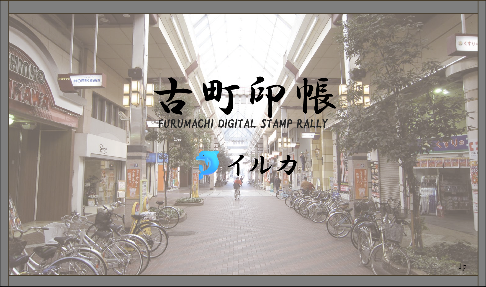

# 古町印帳 🐬



## FURUMACHI DIGITAL STAMP RALLY

新潟・古町エリアを歩きながらスタンプを集めるデジタルスタンプラリーアプリです。
地図でスポットを確認し、現地でキーワードを入力してスタンプをゲットしましょう！

> 新潟コンピュータ専門学校 (NCC) ハッカソン — 🐬 イルカチーム

---

## 目次

- [デモを開く](#デモを開く)
- [使い方](#使い方)
- [スポット一覧 & キーワード](#スポット一覧--キーワード)
- [機能一覧](#機能一覧)
- [技術スタック](#技術スタック)
- [ファイル構成](#ファイル構成)

---

## デモを開く

### 方法1: VS Code + Live Server（推奨）

1. このリポジトリをクローンまたはダウンロードする
2. VS Code で `index.html` を開く
3. 右下の **「Go Live」** ボタンをクリック
4. ブラウザで自動的に開く（`http://127.0.0.1:5500` など）

> 地図タイルが確実に表示されます。

### 方法2: index.html を直接開く

`index.html` をダブルクリックしてブラウザで開く。
地図タイルはほとんどの場合（約9割）読み込まれます。

---

## 使い方

### 基本的な流れ

```text
地図でスポットを探す → 「ここへ向かう」でナビ → 現地でキーワードを入力 → スタンプゲット！
```

1. **地図を見る** — ピンをタップするとスポットの詳細が右パネルに表示される
2. **絞り込む** — カテゴリフィルターでジャンル別に表示を切り替えられる
3. **ナビする** — 「ここへ向かう」ボタンでGoogle マップナビが起動する
4. **スタンプを取得** — 「このスポットでスタンプを取得」を押してキーワードを入力する
5. **全制覇** — 全スポットのスタンプを集めると特典画面が表示される

### ピンの色

| 色 | 意味 |
| - | - |
| ピンク | 未取得スポット |
| 緑 | 取得済みスポット |
| 黄色 | ゴール（景品交換所） |

---

## スポット一覧 & キーワード

> スタンプ取得時に現地で配布・掲示されるキーワードを入力します。

### 🚶 散歩

| スポット名 | 住所 | キーワード |
| - | - | - |
| 古町ルフル | 古町通7番町1010 | `ルフル` |
| 古町通商店街 | 古町通周辺 | `商店街` |
| 白山神社 | 一番堀通町1-1 | `白山` |
| やすらぎ堤 | 信濃川沿い | `やすらぎ` |

### 🍜 ラーメン

| スポット名 | 住所 | キーワード |
| - | - | - |
| 三吉屋 西堀本店 | 西堀通5-829 | `三吉屋` |
| らぁめん 紬麦 | 古町通7番町951-5 | `紬麦` |

### 🍱 新潟グルメ

| スポット名 | 住所 | キーワード |
| - | - | - |
| とんかつ太郎 | 古町通6番町973 | `タレカツ` |
| はり糸 | 古町通5番町618 | `カステラ` |
| 新潟小川屋 | 古町通5番町611 | `小川屋` |

### 🍶 酒

| スポット名 | 住所 | キーワード |
| - | - | - |
| 五郎 古町店 | 古町通8番町1446 | `五郎` |
| 古町寧々 | 古町通8番町1492 | `寧々` |
| 吟 | 古町通7番町1004-2 | `地酒` |

### 🛍️ 雑貨

| スポット名 | 住所 | キーワード |
| - | - | - |
| hickory03travelers | 古町通3番町556 | `浮き星` |

### ☕ カフェ・喫茶店

| スポット名 | 住所 | キーワード |
| - | - | - |
| シャモニー 古町店 | 古町通5番町591 | `シャモニー` |
| Kaffaパルム | 古町通6番町987 | `パルム` |
| 喫茶ニュー古町 | 東堀通9番町1407-17 | `ニュー古町` |
| 上古町の百年長屋SAN | 古町通3番町653 | `百年長屋` |
| SugarCOAT | 西堀通3-802-3 | `紅茶` |
| 台湾 キレイ 茶芸大使館 | 東堀通4番町452 | `台湾` |

### 🏆 ゴール

| スポット名 | キーワード |
| - | - |
| 景品交換所 | `完全制覇` |

---

## 機能一覧

- **インタラクティブ地図** — [OpenStreetMap](https://www.openstreetmap.org/) + [Leaflet.js](https://leafletjs.com/) によるピン表示
- **カテゴリフィルター** — ジャンル別にスポットを絞り込み
- **現在地取得** — [Geolocation API](https://developer.mozilla.org/ja/docs/Web/API/Geolocation_API) で自分の位置を地図に表示 + 各スポットまでの距離を計算
- **キーワード認証** — 現地でもらうキーワードを入力してスタンプを押印（大文字小文字・全半角を自動統一）
- **進捗管理** — [localStorage](https://developer.mozilla.org/ja/docs/Web/API/Window/localStorage) にスタンプ取得状況を保存（ブラウザを閉じても保持）
- **スタンプ帳** — 取得済みスタンプを一覧表示
- **Google マップナビ** — 「ここへ向かう」ボタンで [Google マップ](https://maps.google.com/) のナビを起動
- **全制覇特典** — 全スポット制覇で「古町マスター」認定画面を表示

---

## 技術スタック

| 技術 | 用途 |
| - | - |
| HTML / CSS / JavaScript | フロントエンド |
| [Leaflet.js](https://leafletjs.com/) v1.9.4 | 地図表示 |
| [OpenStreetMap](https://www.openstreetmap.org/) | 地図タイル |
| [localStorage](https://developer.mozilla.org/ja/docs/Web/API/Window/localStorage) | スタンプデータの保存 |
| [Geolocation API](https://developer.mozilla.org/ja/docs/Web/API/Geolocation_API) | 現在地取得 |

---

## ファイル構成

```text
hackathon/
├── index.html   # メインページ
├── style.css    # スタイル
├── script.js    # ロジック（スポットデータ・地図・スタンプ処理）
└── img/         # スポット画像
```
